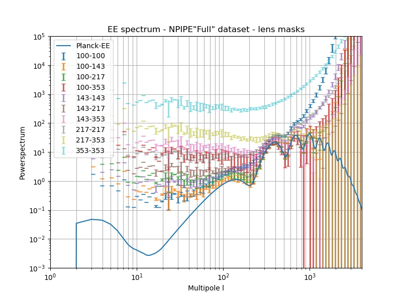
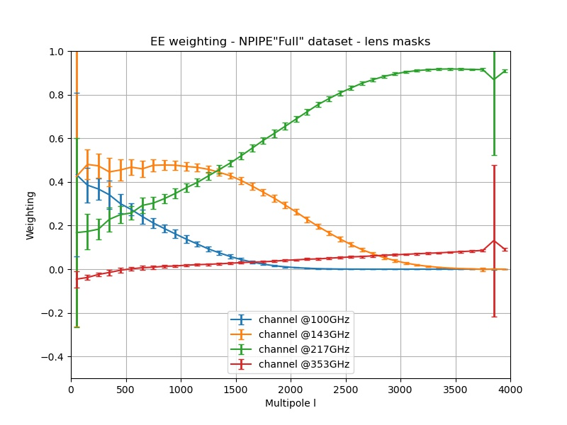

.. image:: https://img.shields.io/badge/Status-in%20development-red.svg
   :target: https://img.shields.io/badge/Status-in%20development-red.svg
   :alt:

.. image:: https://readthedocs.org/projects/component-separation/badge/?version=master
   :target: https://component-separation.readthedocs.io/?badge=master
   :alt: Documentation Status

.. image:: https://github.com/Sebastian-Belkner/component_separation/workflows/Test/badge.svg?branch=development
   :target: https://github.com/Sebastian-Belkner/component_separation/workflows/Test/badge.svg?branch=development
   :alt: Test status

Component Separation - summary
====================================

Calculate the weightings of the latest (NPIPE) Planck frequency channels using SMICA

Powerspectrum
==================

Example powerspectra, which may still include foregrounds and noise,

Channel weights
==================

Example weights for the individual channels,

Documentation
==================

May be found at readthedocs: https://component-separation.readthedocs.io/en/master/
